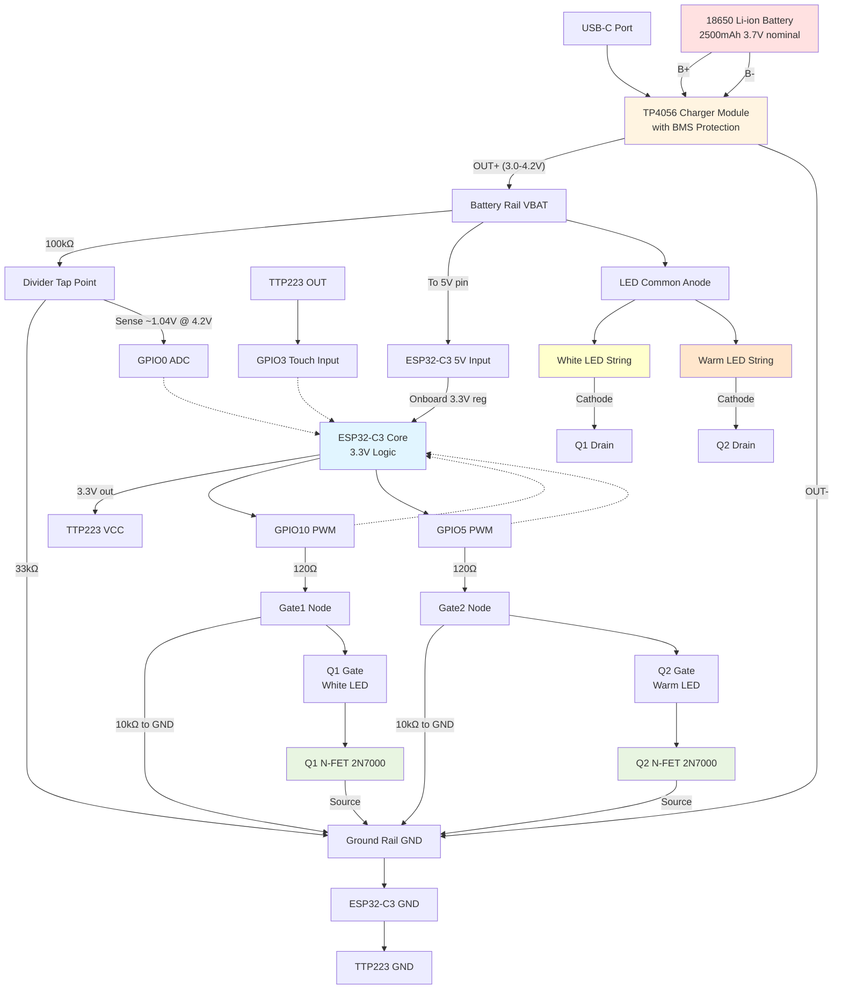

# Desk Lamp Rebuild Project

## Project Overview

Rebuilding a failed table LED lamp using salvaged components (LED assembly and frame) with new electronics. The original lamp had unreliable charging circuitry and a suspiciously low-capacity battery. This rebuild aims to create a reliable, long-lasting lamp with better battery life and user-friendly low-battery warnings.

## Original Lamp Specifications

- USB-C charging port
- 18650 LiFePO4 battery (claimed 600mAh - suspicious)
- Three-wire LED connection: white LED, warm LED, and common ground
- Capacitive touch button (exposed metal with single wire)
- Simple on/cycle/off operation

**Failure mode:** Completely dead, even with mains power. Worked once after attempted charge, then never again.

## Design Goals

1. Reliable charging and power management
2. Improved battery capacity (2000-3000mAh)
3. Low-battery warning indicator
4. Simple operation (press to cycle modes, long-press for off)
5. Efficient power usage with deep sleep capability
6. Easy to build on perfboard with through-hole components

## Components List

### Core Electronics
- **ESP32-C3 SuperMini** development board (~£1-2)
  - Native USB-C for programming
  - 3.3V logic, chip operates 3.0-3.6V internally
  - Onboard regulator accepts 3.0-5.5V at 5V input
  - Deep sleep ~10µA
  - WiFi/BLE present but unused
- **TP4056 USB-C charger module** with protection
- **18650 Li-ion battery** (2000-3000mAh, standard 3.7V nominal)
- **TTP223 capacitive touch module**

### Switching and Control
- **2× N-channel MOSFETs** (TO-92 package for through-hole)
  - Suitable types: 2N7000, BS170
  - For switching LED strings to ground

### Passive Components
- **Voltage divider for battery monitoring:**
  - 100kΩ resistor (high side)
  - 33kΩ resistor (low side) - gives 1.04V at 4.2V battery, good ADC resolution
  - Alternative: 22kΩ (low side) - gives 0.76V at 4.2V, more headroom but lower resolution
  - High impedance to minimise parasitic drain (~11µA @ 3.7V with 33kΩ)
- **MOSFET gate resistors:**
  - 2× 120Ω resistors (GPIO to MOSFET gate, current limiting)
  - 2× 10kΩ resistors (gate to ground pull-down, prevents float during boot)
- **LED current limiting resistors** (values TBD based on LED specifications)
- Pin headers for modular connections

## Wiring Diagram

### Block Diagram (Mermaid)



### Detailed Circuit Diagram (ASCII)

```
                    USB-C
                      │
                 ┌────┴────┐
                 │  TP4056 │
                 │ Charger │
                 └─┬────┬──┘
                   │    │
        ┌──────────┘    └──────────┐
        │                          │
     B+ │                       B- │
   ┌────┴─────┐                   │
   │  18650   │                   │
   │  Li-ion  │                   │
   └────┬─────┘                   │
        │                         │
        │  100kΩ                  │
        ├─────┐                   │
        │     │                   │
        │    ─┴─ 33kΩ             │
        │     │                   │
        │     ├──────────────────→ GPIO0 (battery monitor)
        │     │                   │
   OUT+ │    ─┴─                  │ OUT-
        │     │                   │
        ├─────┼───────────────────┴──────┐
        │     │                          │
        │    GND ←────────────────────┐  │
        │                             │  │
        └─────┬──────────────┐        │  │
              │              │        │  │
          BATT V+       BATT V+       │  │
              │              │        │  │
              │   ┌──────────┴────────┴──┴────┐
              │   │   ESP32-C3 SuperMini      │
              │   │                           │
              │   │  5V ←─── (via onboard reg)│
              │   │  GND                      │
              │   │                           │
              │   │  GPIO3 ←─────┐           │
              │   │  GPIO10 ──┐  │           │
              │   │  GPIO5  ──┼──┼──────┐    │
              │   └───────────┼──┼──────┼────┘
              │               │  │      │
              │           ┌───┘  │      │
              │           │  ┌───┴───┐  │
              │           │  │TTP223 │  │
              │           │  │ Touch │  │
              │           │  └───┬───┘  │
              │           │      │      │
              │           │     3.3V   GND
              │           │
              │         [120Ω]       [120Ω]
              │           │             │
              │           ├──────┐      ├──────┐
              │           │ 10kΩ │      │ 10kΩ │
              │           │  │   │      │  │   │
              │          Gate  ─┴─     Gate  ─┴─
              │           │             │
              │        ┌──┴──┐       ┌──┴──┐
              │        │ Q1  │       │ Q2  │
              │        │N-FET│       │N-FET│
              │        └──┬──┘       └──┬──┘
              │           │             │
              │         Drain         Drain
              │           │             │
              │     ┌─────┴──────┐      │
              │     │ White LED  │      │
              │     └────────────┘      │
              │           │             │
              │     ┌─────┴──────────────┘
              │     │  Warm LED  │
              │     └────────────┘
              │           │
              └───────────┘
            (Common anode to BATT V+)

MOSFET Gate Circuit Detail:
  GPIO10 ──[120Ω]──┬── Q1 Gate
                   │
                 [10kΩ]
                   │
                  GND

  GPIO5 ──[120Ω]───┬── Q2 Gate
                   │
                 [10kΩ]
                   │
                  GND
```

## Key Design Decisions

### Power Path
- **Battery connects to 5V input pin** on ESP32-C3 SuperMini
- Onboard regulator provides stable 3.3V to ESP32-C3 chip (which operates 3.0-3.6V internally)
- Regulator input accepts 3.0-5.5V, allowing full battery discharge down to ~3.0V
- **LED common anode connects to battery V+** (not regulated 3.3V) for maximum brightness capability
- This design is **safe** - the ESP32-C3 chip never sees the 4.2V fully-charged battery voltage

### Battery Monitoring
- **Simple voltage divider approach** (no fuel gauge IC needed)
- High-impedance divider (133kΩ total: 100kΩ + 33kΩ) minimises parasitic drain (~11µA @ 3.7V)
- Voltage divider connected between battery V+ and GND, tap point to GPIO0
- ESP32-C3 uses 3.3V ADC reference (12-bit resolution)
- Voltage scaling: 4.2V battery → 1.042V at GPIO0 (ADC pin)

### Battery Voltage Thresholds
- **4.2V** - Fully charged
- **3.7V** - ~50% (nominal voltage)
- **3.5V** - Low battery warning threshold
- **3.2V** - Critical, consider shutdown
- **3.0V** - Hard cutoff to protect battery

### ADC Configuration
For ESP32-C3 with voltage divider on GPIO0:
```cpp
analogReadResolution(12);  // 12-bit ADC (0-4095)
// ADC uses 3.3V reference (stable from onboard regulator)
int adcValue = analogRead(BATTERY_PIN);  // GPIO0
float voltage = adcValue * (3.3 / 4095.0) * (133.0 / 33.0);  // Scale back to battery voltage
// Scaling factor: (100kΩ + 33kΩ) / 33kΩ = 4.030
```

The onboard regulator provides a stable 3.3V reference independent of varying battery voltage.

**Alternative with 22kΩ:** If using 22kΩ instead of 33kΩ:
```cpp
float voltage = adcValue * (3.3 / 4095.0) * (122.0 / 22.0);  // Scaling factor = 5.545
// Gives 0.757V at 4.2V battery (more headroom, slightly lower resolution)
```

### Touch Sensing
- **TTP223 module recommended** over Arduino capacitive library
- Enables deep sleep mode (~10µA vs ~5-10mA)
- Simple 3-wire connection (VCC, GND, OUT)
- Active-high output suitable for interrupt wake-up

## State Machine Design

```
┌─────────────────────────────────────────────────┐
│  STARTUP                                        │
│  └→ Check battery voltage                      │
│     └→ If low: set warning flag                │
└────────────┬────────────────────────────────────┘
             │
             ▼
        ┌────────┐
        │  OFF   │ ◄──────────────┐
        │        │                │
        │ LEDs:  │                │
        │  Both  │                │
        │  off   │                │
        └────┬───┘                │
             │                    │
      Touch detected             │
             │               Long press
             ▼               (>2s)
        ┌────────┐               │
        │ WHITE  │───────────────┘
        │  FULL  │
        │        │
        │ LEDs:  │
        │  White │
        │  100%  │
        └────┬───┘
             │
      Touch detected
             │
             ▼
        ┌────────┐
        │  WARM  │
        │  FULL  │
        │        │
        │ LEDs:  │
        │  Warm  │
        │  100%  │
        └────┬───┘
             │
      Touch detected
             │
             ▼
        ┌────────┐
        │  BOTH  │
        │  FULL  │
        │        │
        │ LEDs:  │
        │  Both  │
        │  100%  │
        └────┬───┘
             │
      Touch detected
             │
             └──────► (cycle back to OFF)
```

### State Behaviours

**OFF State:**
- Both MOSFETs off
- MCU in deep sleep mode
- Wake on touch interrupt
- Minimal power draw (~10µA)

**ON States (WHITE / WARM / BOTH):**
- Appropriate MOSFET(s) enabled via PWM
- Periodic battery voltage checks
- Respond to touch for state changes
- Monitor for long-press (return to OFF)

**Low Battery Warning:**
When entering any ON state with battery voltage < 3.5V:
- Pulse all active LEDs 3× quickly before settling to steady state
- Alternative: Brief simultaneous flash of both LED strings

### Optional Future Features
- **Dimming mode:** Hold touch for >500ms to cycle through brightness levels (100% → 75% → 50% → 25%)
- **Memory:** Remember last used mode/brightness
- **Auto-off timer:** Sleep after X minutes of inactivity

## Software Architecture

### Core Functions Needed

1. **Touch detection** - Interrupt-driven on D2/INT pin
2. **PWM LED control** - Smooth brightness control on D9, D10
3. **Battery monitoring** - Periodic ADC reads on A0
4. **State management** - Handle state transitions and timing
5. **Sleep mode** - Deep sleep in OFF state, wake on interrupt
6. **Debouncing** - Clean touch event handling

### Pseudo-code Structure

```cpp
// Pin definitions
#define TOUCH_PIN 2        // Interrupt pin
#define WHITE_LED 9        // PWM pin
#define WARM_LED 10        // PWM pin
#define BATTERY_PIN A0     // ADC pin

// States
enum State {
  OFF,
  WHITE_FULL,
  WARM_FULL,
  BOTH_FULL
};

State currentState = OFF;
bool lowBatteryFlag = false;

void setup() {
  analogReadResolution(12);   // ESP32-C3: 12-bit ADC
  pinMode(WHITE_LED, OUTPUT);
  pinMode(WARM_LED, OUTPUT);
  pinMode(TOUCH_PIN, INPUT);

  attachInterrupt(digitalPinToInterrupt(TOUCH_PIN), touchISR, RISING);

  checkBatteryLevel();
}

void loop() {
  if (currentState == OFF) {
    enterDeepSleep();
  } else {
    updateLEDs();
    
    if (millis() % 10000 == 0) {  // Check every 10s
      checkBatteryLevel();
    }
    
    handleLongPress();  // Check for return to OFF
  }
}

void touchISR() {
  // Handle touch event
  // Advance state machine
  // Show low battery warning if flag set
}

void checkBatteryLevel() {
  int adcValue = analogRead(BATTERY_PIN);  // GPIO0
  // ESP32-C3: 12-bit ADC, 3.3V reference
  // Voltage divider: 100kΩ + 33kΩ, scaling factor = 133/33 = 4.030
  float voltage = adcValue * (3.3 / 4095.0) * (133.0 / 33.0);

  if (voltage < 3.5) {
    lowBatteryFlag = true;
  } else {
    lowBatteryFlag = false;
  }
}
```

## Build Notes

### Physical Construction
- Mount on perfboard inside lamp base
- 3D print insert/holder for clean mounting
- Use female pin headers for modularity
- Consider strain relief for LED wires
- Access to USB-C port for charging

### Component Selection
- **MOSFETs:** TO-92 package for easy through-hole soldering
- **Resistors:** Standard 1/4W through-hole resistors
- **Battery holder:** Secure mounting, consider spring contacts vs solder tabs

### Testing Checklist
- [ ] Verify voltage divider scaling (4.2V battery → ~1.042V at GPIO0 with 33kΩ)
- [ ] Confirm onboard regulator operates down to 3.0V input at 5V pin
- [ ] Test MOSFET switching at low battery voltages
- [ ] Verify gate resistors prevent LED glow during ESP32 boot/programming
- [ ] **CRITICAL:** Test LEDs are completely off in OFF state (no faint glow)
  - **During normal OFF state**: PWM=0 may not guarantee 0V, causing LED ghosting
    - Fix: Detach PWM (`ledcDetachPin()`) and force GPIO LOW (`digitalWrite(pin, LOW)`)
  - **During deep sleep**: GPIO leakage can partially turn on MOSFETs
    - Fix: Use `gpio_hold_en()` before sleep, `gpio_hold_dis()` on wake
- [ ] Measure standby current in OFF state (target ~22.5µA)
- [ ] Verify charging indication on TP4056
- [ ] Test all state transitions
- [ ] Verify low battery warning triggers correctly
- [ ] Measure runtime at different brightness levels

## Power Budget Estimates

### OFF State (Sleep)
- ESP32-C3 deep sleep: ~10µA
- TTP223 standby: ~1.5µA
- Voltage divider: ~11µA (3.7V / 133kΩ with 100k+33k resistors)
- **Total: ~22.5µA**
- **Standby time with 2500mAh battery: ~12 years** (theoretical)

### ON State (Active)
- ESP32-C3 active: ~80mA (worst case)
- White LED: ~20-50mA (estimate, depends on specs)
- Warm LED: ~20-50mA (estimate)
- **Total: 120-180mA** (both LEDs at full brightness)
- **Runtime with 2500mAh battery: ~14-20 hours** (continuous)

Actual runtime will be much longer with mixed usage and dimming.

## Safety Considerations

1. **Battery protection:** TP4056 module should include over-charge and over-discharge protection
2. **Current limiting:** Use appropriate resistors for LEDs to prevent thermal damage
3. **Voltage monitoring:** Implement hard cutoff at 3.0V to protect battery longevity
4. **Thermal management:** Ensure adequate ventilation in lamp base
5. **Short circuit protection:** Consider adding a fuse in battery positive line

## Future Improvements

### Possible Enhancements
- **OTA updates:** Use ESP32-C3 WiFi capability for wireless programming
- **Scheduling:** Auto-on/off at specific times
- **Ambient light sensor:** Auto-brightness adjustment
- **Phone app control:** BLE or WiFi interface
- **USB-C power delivery:** Use lamp as phone charger (pass-through)
- **Multi-colour LEDs:** RGB strips for colour temperature adjustment

### Why ESP32-C3 Was Chosen
Even though wireless features aren't initially needed:
- Same or lower cost than Pro Mini
- Native USB-C (no FTDI adapter)
- Superior power efficiency in sleep mode
- Better ADC resolution (12-bit vs 10-bit)
- Future-proof for feature additions
- Modern toolchain and library support
- WiFi/BLE stay dormant if unused (zero complexity added)

## Bill of Materials (AliExpress Order)

### Essential
- [ ] ESP32-C3 SuperMini (×2-3 for spares)
- [ ] TP4056 USB-C charger modules (×3-5)
- [ ] TTP223 capacitive touch modules (×5-10 pack)
- [ ] 2N7000 or BS170 N-FETs (×10 pack)
- [ ] 18650 Li-ion battery (2500-3000mAh, protected cells)
- [ ] Resistor assortment (1/4W through-hole):
  - 2× 120Ω (MOSFET gate series resistors)
  - 2× 10kΩ (MOSFET gate pull-down resistors)
  - 1× 100kΩ (voltage divider high side)
  - 1× 33kΩ (voltage divider low side) - or 22kΩ alternative
  - LED current limiting resistors (values TBD based on LED specs)

### Nice to Have
- [ ] 18650 battery holders (panel mount)
- [ ] Female pin headers strips
- [ ] Perfboard (various sizes)
- [ ] USB-C breakout boards
- [ ] Small slide/toggle switches
- [ ] Heatshrink tubing assortment

## Document Revision History

- **v1.3** - Fixed LED ghosting issue in deep sleep:
  - Added critical fix: `gpio_hold_en()` required to prevent GPIO leakage
  - Removed schemdraw schematic (use KiCAD for proper schematics instead)
  - Updated testing checklist with deep sleep LED glow verification
- **v1.2** - Updated resistor values to match available parts:
  - Changed voltage divider to 100kΩ + 33kΩ (was 27kΩ) - gives 1.042V at 4.2V
  - Changed gate resistors to 120Ω (was 100Ω)
  - Improved Mermaid diagram clarity (clearer MOSFET connections, proper TP4056 flow)
  - Added alternative 22kΩ voltage divider option
  - Recalculated parasitic drain (~22.5µA total in deep sleep)
- **v1.1** - Updated wiring diagrams:
  - Corrected power path (battery to 5V input via onboard regulator)
  - Added MOSFET gate resistors (100Ω series + 10kΩ pull-down)
  - Added Mermaid block diagram for better visualization
  - Updated ADC calculations for ESP32-C3
- **v1.0** - Initial project documentation
- Created: January 2026