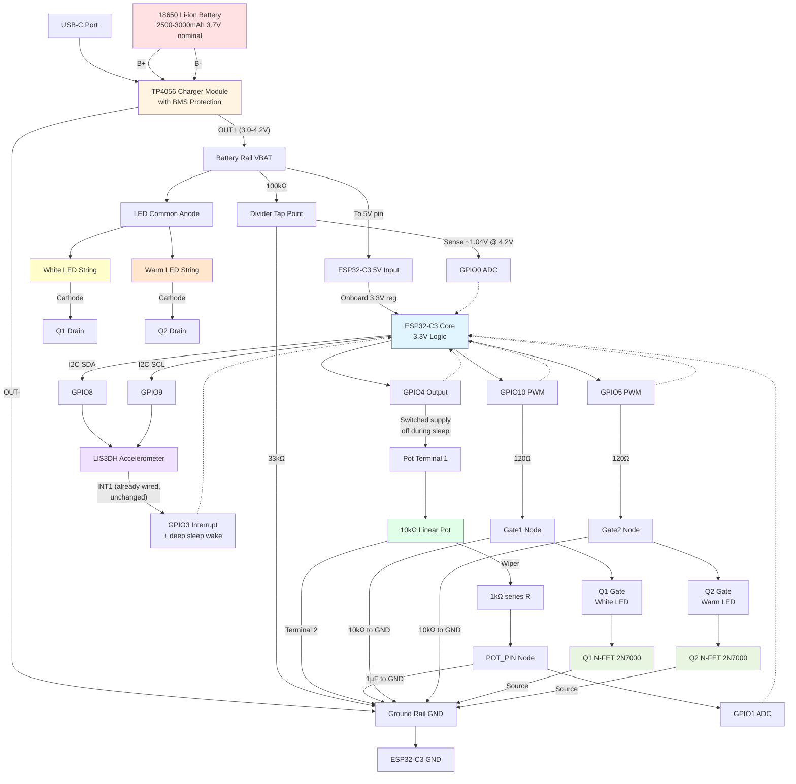

# Desk Lamp Rebuild Project

## Project Overview

Rebuilding a failed table LED lamp using salvaged components (LED assembly and frame) with new electronics. The original lamp had unreliable charging circuitry and a suspiciously low-capacity battery. This rebuild aims to create a reliable, long-lasting lamp with better battery life and user-friendly low-battery warnings.

## Original Lamp Specifications

- USB-C charging port
- 18650 LiFePO4 battery (claimed 600mAh - suspicious)
- Three-wire LED connection: white LED, warm LED, and common ground
- Capacitive touch button (exposed metal with single wire)
- Simple on/cycle/off operation

**Failure mode:** Completely dead, even with mains power. Worked once after attempted charge, then never again.

## Design Goals

1. Reliable charging and power management
2. Improved battery capacity (2000-3000mAh)
3. Low-battery warning indicator with intelligent state machine
4. Intuitive operation — potentiometer for on/off + live brightness by default, or a
   physical button (tap to toggle, hold for brightness) as a compile-time alternative
5. Efficient power usage with deep sleep capability (~21-27µA in both input modes)
6. Smooth gamma-corrected brightness control
7. Easy to build on perfboard with through-hole components
8. Reliable recovery from firmware faults (task watchdog + I2C timeout) rather than an
   unresponsive lamp requiring a battery pull

## Components List

### Core Electronics
- **ESP32-C3 SuperMini** development board (~£1-2)
  - Native USB-C for programming
  - 3.3V logic, chip operates 3.0-3.6V internally
  - Onboard regulator accepts 3.0-5.5V at 5V input
  - Deep sleep ~10µA
  - WiFi/BLE present but unused
- **TP4056 USB-C charger module** with protection
- **18650 Li-ion battery** (2000-3000mAh, standard 3.7V nominal)
- **Primary control — one of:**
  - **10kΩ linear-taper potentiometer** (default, `USE_POT_INPUT` in `config.h`) — must be
    linear, not audio/log taper, since brightness mapping is a straight linear function of
    ADC reading
  - **Physical momentary pushbutton** (normally-open) — compile-time alternative; both share
    the same GPIO (GPIO1, chosen because it was free and physically accessible — GPIO3 is
    already hardwired to the accelerometer on the existing board), only one is ever wired up
- **LIS3DH accelerometer module** (e.g. SparkFun SEN-13963) — already wired (GPIO3), unchanged
  by this work; auxiliary double/triple-tap mode-swap (WARM ↔ COOL) gesture in both input
  modes; also the sole deep-sleep wake source when the potentiometer is in use (required
  there, optional in button mode)

### Switching and Control
- **2× N-channel MOSFETs** (TO-92 package for through-hole)
  - Suitable types: 2N7000, BS170
  - For switching LED strings to ground

### Passive Components
- **Voltage divider for battery monitoring:**
  - 100kΩ resistor (high side)
  - 33kΩ resistor (low side) - gives 1.04V at 4.2V battery, good ADC resolution
  - Alternative: 22kΩ (low side) - gives 0.76V at 4.2V, more headroom but lower resolution
  - High impedance to minimise parasitic drain (~11µA @ 3.7V with 33kΩ)
- **MOSFET gate resistors:**
  - 2× 120Ω resistors (GPIO to MOSFET gate, current limiting)
  - 2× 10kΩ resistors (gate to ground pull-down, prevents float during boot)
- **Potentiometer RC front end** (pot mode only, analog complement to firmware-side
  filtering — see `doc/firmware_architecture.md` for the full derivation):
  - 1× 1kΩ resistor (wiper to `POT_PIN`, series)
  - 1× 1µF ceramic capacitor (X7R, ≥6.3V — `POT_PIN` to GND, shunt)
- **Button pull-down** (button mode only, if not using the potentiometer): 1× 10kΩ resistor
  (`BUTTON_PIN` to GND)
- **LED current limiting resistors** (values TBD based on LED specifications)
- Pin headers for modular connections

## Wiring Diagram

Primary control is a compile-time choice (`USE_POT_INPUT` in `config.h`) — the diagrams
below show the potentiometer (default); see the Button Mode Alternative note for the swap.

### Block Diagram (Mermaid)


```mermaid
graph TB
    USB[USB-C Port] --> TP4056[TP4056 Charger Module<br/>with BMS Protection]

    BATT[18650 Li-ion Battery<br/>2500-3000mAh 3.7V nominal] --> |"B+"| TP4056
    BATT --> |"B-"| TP4056

    TP4056 --> |"OUT+ (3.0-4.2V)"| VBAT_RAIL[Battery Rail VBAT]
    TP4056 --> |"OUT-"| GND_RAIL[Ground Rail GND]

    VBAT_RAIL --> |"100kΩ"| VDIV_TAP[Divider Tap Point]
    VDIV_TAP --> |"33kΩ"| GND_RAIL
    VDIV_TAP --> |"Sense ~1.04V @ 4.2V"| GPIO0[GPIO0 ADC]

    VBAT_RAIL --> |"To 5V pin"| ESP32_5V[ESP32-C3 5V Input]
    ESP32_5V --> |"Onboard 3.3V reg"| ESP32_CORE[ESP32-C3 Core<br/>3.3V Logic]
    GND_RAIL --> ESP32_GND[ESP32-C3 GND]

    ESP32_CORE --> GPIO4[GPIO4 Output]
    GPIO4 --> |"Switched supply<br/>off during sleep"| POT_T1[Pot Terminal 1]
    POT_T1 --> POT[10kΩ Linear Pot]
    POT --> |"Terminal 2"| GND_RAIL
    POT --> |"Wiper"| POT_R["1kΩ series R"]
    POT_R --> POT_NODE[POT_PIN Node]
    POT_NODE --> |"1µF to GND"| GND_RAIL
    POT_NODE --> GPIO1[GPIO1 ADC]

    ESP32_CORE --> |"I2C SDA"| GPIO8[GPIO8]
    ESP32_CORE --> |"I2C SCL"| GPIO9[GPIO9]
    GPIO8 --> LIS3DH[LIS3DH Accelerometer]
    GPIO9 --> LIS3DH
    LIS3DH --> |"INT1 (already wired,<br/>unchanged)"| GPIO3[GPIO3 Interrupt<br/>+ deep sleep wake]

    ESP32_CORE --> GPIO10[GPIO10 PWM]
    ESP32_CORE --> GPIO5[GPIO5 PWM]

    GPIO10 --> |"120Ω"| GATE1_RES[Gate1 Node]
    GATE1_RES --> |"10kΩ to GND"| GND_RAIL
    GATE1_RES --> Q1_GATE[Q1 Gate<br/>White LED]
    Q1_GATE --> Q1[Q1 N-FET 2N7000]

    GPIO5 --> |"120Ω"| GATE2_RES[Gate2 Node]
    GATE2_RES --> |"10kΩ to GND"| GND_RAIL
    GATE2_RES --> Q2_GATE[Q2 Gate<br/>Warm LED]
    Q2_GATE --> Q2[Q2 N-FET 2N7000]

    VBAT_RAIL --> LED_COMMON[LED Common Anode]
    LED_COMMON --> WHITE_LED[White LED String]
    LED_COMMON --> WARM_LED[Warm LED String]

    WHITE_LED --> |"Cathode"| Q1_DRAIN[Q1 Drain]
    WARM_LED --> |"Cathode"| Q2_DRAIN[Q2 Drain]

    Q1 --> |"Source"| GND_RAIL
    Q2 --> |"Source"| GND_RAIL

    GPIO0 -.-> ESP32_CORE
    GPIO1 -.-> ESP32_CORE
    GPIO3 -.-> ESP32_CORE
    GPIO4 -.-> ESP32_CORE
    GPIO10 -.-> ESP32_CORE
    GPIO5 -.-> ESP32_CORE

    style ESP32_CORE fill:#e1f5ff
    style BATT fill:#ffe1e1
    style TP4056 fill:#fff4e1
    style Q1 fill:#e8f5e1
    style Q2 fill:#e8f5e1
    style WHITE_LED fill:#ffffcc
    style WARM_LED fill:#ffe6cc
    style LIS3DH fill:#f0e1ff
    style POT fill:#e1ffe8
```

### Detailed Circuit Diagram (ASCII)

```
                    USB-C
                      │
                 ┌────┴────┐
                 │  TP4056 │
                 │ Charger │
                 └─┬────┬──┘
                   │    │
        ┌──────────┘    └──────────┐
        │                          │
     B+ │                       B- │
   ┌────┴─────┐                   │
   │  18650   │                   │
   │  Li-ion  │                   │
   └────┬─────┘                   │
        │                         │
        │  100kΩ                  │
        ├─────┐                   │
        │     │                   │
        │    ─┴─ 33kΩ             │
        │     │                   │
        │     ├──────────────────→ GPIO0 (battery monitor)
        │     │                   │
   OUT+ │    ─┴─                  │ OUT-
        │     │                   │
        ├─────┼───────────────────┴──────┐
        │     │                          │
        │    GND ←────────────────────┐  │
        │                             │  │
        └─────┬──────────────┐        │  │
              │              │        │  │
          BATT V+       BATT V+       │  │
              │              │        │  │
              │   ┌──────────┴────────┴──┴──────────────────────┐
              │   │            ESP32-C3 SuperMini                │
              │   │                                              │
              │   │  5V  ←── (via onboard reg)                   │
              │   │  GND                                         │
              │   │                                              │
              │   │  GPIO4  ──► pot power switch (pot mode)   ───┼──► see Potentiometer Detail
              │   │  GPIO1  ◄── pot wiper / physical button   ───┼──► see Potentiometer Detail /
              │   │                                              │    Button Mode Alternative
              │   │  GPIO3  ◄── LIS3DH INT1 (already wired,   ───┼──► see Accelerometer Detail
              │   │            unchanged by this work)           │
              │   │  GPIO8  ── I2C SDA                        ───┼──► see Accelerometer Detail
              │   │  GPIO9  ── I2C SCL                        ───┼──► see Accelerometer Detail
              │   │  GPIO10 ──┐                                  │
              │   │  GPIO5  ──┼──┐                               │
              │   └───────────┼──┼───────────────────────────────┘
              │               │  │
              │             [120Ω]       [120Ω]
              │               │             │
              │               ├──────┐      ├──────┐
              │               │ 10kΩ │      │ 10kΩ │
              │               │  │   │      │  │   │
              │              Gate  ─┴─     Gate  ─┴─
              │               │             │
              │            ┌──┴──┐       ┌──┴──┐
              │            │ Q1  │       │ Q2  │
              │            │N-FET│       │N-FET│
              │            └──┬──┘       └──┬──┘
              │               │             │
              │             Drain         Drain
              │               │             │
              │         ┌─────┴──────┐      │
              │         │ White LED  │      │
              │         └────────────┘      │
              │               │             │
              │         ┌─────┴──────────────┘
              │         │  Warm LED  │
              │         └────────────┘
              │               │
              └───────────────┘
            (Common anode to BATT V+)

Potentiometer Detail (pot mode, USE_POT_INPUT defined — default):
  GPIO4 ─────────┬── Pot Terminal 1     (switched supply, off during deep sleep,
                  │                      no transistor needed — see doc/firmware_architecture.md)
                [10kΩ linear taper pot]
                  │
  GND ────────────┴── Pot Terminal 2

  Wiper ──[1kΩ]──┬── GPIO1 (POT_PIN, ADC)  — free and physically accessible; GPIO3 is
                  │                          already the LIS3DH's, deliberately not reused here
                [1µF]
                  │
                 GND

Button Mode Alternative (USE_POT_INPUT commented out in config.h):
  3.3V ──[Button]──┬── GPIO1 (BUTTON_PIN)
                    │
                  [10kΩ]
                    │
                   GND
  (GPIO4 pot-power switch is unused in this mode; the potentiometer branch above is
  replaced entirely by this button + pull-down.)

Accelerometer Detail (mode-swap gesture, LIS3DH — both input modes):
  GPIO8 (SDA) ──────── LIS3DH SDA
  GPIO9 (SCL) ──────── LIS3DH SCL
  GPIO3       ◄─────── LIS3DH INT1   (also the deep-sleep wake pin in pot mode only —
                                       already wired here from before the pot/button
                                       work, unchanged by it)
  3.3V        ──────── LIS3DH VCC
  GND         ──────── LIS3DH GND

MOSFET Gate Circuit Detail:
  GPIO10 ──[120Ω]──┬── Q1 Gate
                    │
                  [10kΩ]
                    │
                   GND

  GPIO5 ──[120Ω]───┬── Q2 Gate
                    │
                  [10kΩ]
                    │
                   GND
```

## Key Design Decisions

### Power Path
- **Battery connects to 5V input pin** on ESP32-C3 SuperMini
- Onboard regulator provides stable 3.3V to ESP32-C3 chip (which operates 3.0-3.6V internally)
- Regulator input accepts 3.0-5.5V, allowing full battery discharge down to ~3.0V
- **LED common anode connects to battery V+** (not regulated 3.3V) for maximum brightness capability
- This design is **safe** - the ESP32-C3 chip never sees the 4.2V fully-charged battery voltage

### Battery Monitoring
- **Simple voltage divider approach** (no fuel gauge IC needed)
- High-impedance divider (133kΩ total: 100kΩ + 33kΩ) minimises parasitic drain (~11µA @ 3.7V)
- Voltage divider connected between battery V+ and GND, tap point to GPIO0
- ESP32-C3 uses 3.3V ADC reference (12-bit resolution)
- Voltage scaling: 4.2V battery → 1.042V at GPIO0 (ADC pin)

### Battery Voltage Thresholds
- **4.2V** - Fully charged
- **3.7V** - ~50% (nominal voltage)
- **3.5V** - Low battery warning threshold
- **3.2V** - Critical, consider shutdown
- **3.0V** - Hard cutoff to protect battery

### ADC Configuration
For ESP32-C3 with voltage divider on GPIO0:
```cpp
analogReadResolution(12);  // 12-bit ADC (0-4095)
// ADC uses 3.3V reference (stable from onboard regulator)
int adcValue = analogRead(BATTERY_PIN);  // GPIO0
float voltage = adcValue * (3.3 / 4095.0) * (133.0 / 33.0);  // Scale back to battery voltage
// Scaling factor: (100kΩ + 33kΩ) / 33kΩ = 4.030
```

The onboard regulator provides a stable 3.3V reference independent of varying battery voltage.

**Alternative with 22kΩ:** If using 22kΩ instead of 33kΩ:
```cpp
float voltage = adcValue * (3.3 / 4095.0) * (122.0 / 22.0);  // Scaling factor = 5.545
// Gives 0.757V at 4.2V battery (more headroom, slightly lower resolution)
```

### Primary Input: Potentiometer or Button

`USE_POT_INPUT` in `config.h` selects exactly one primary control at compile time; both
share GPIO1 since only one is ever physically wired up (GPIO1 was free on the existing
board and physically accessible; GPIO3 is already the LIS3DH's INT1 and is deliberately
not reused). Full detail
(mapping, hysteresis, noise filtering, timing) is in `doc/firmware_architecture.md` — this
is the summary.

**Potentiometer (default):** a live, continuously-polled analog control, not a discrete
gesture. The pot's position directly maps to brightness; turning it to/below a threshold
near the bottom of its travel turns the lamp off, with separate off/on thresholds
(hysteresis) so noise at the boundary can't flicker it. Nothing about brightness is
persisted — the pot's current position always *is* the requested brightness. Since the
ESP32-C3 can't wake from an ADC threshold, the accelerometer becomes the deep-sleep wake
source in this mode (enforced by a compile-time check — pot mode without the accelerometer
would leave no way to wake the device).

**Physical button (alternative):** the original tap/hold gesture model — single tap
toggles on/off, double tap swaps WARM/COOL, long press adjusts brightness, triple tap
shows the battery indicator. The button itself is the deep-sleep wake source in this mode.

### Accelerometer Mode-Swap Gesture

The LIS3DH is an auxiliary input in both modes, used only to swap WARM ↔ COOL. It requires
an **exact** tap count (`ACCEL_MODE_SWAP_TAP_COUNT` in `config.h`, default 2 — double tap),
not "2 or more": a single tap is always ignored, since in pot mode especially the
accelerometer is mounted to the same enclosure the user's hand is on constantly while
turning the dial — treating every tap as a mode swap would mean ordinary brightness
adjustment randomly flipped the color mode. Requiring an exact count (rather than a
threshold) also reserves the *other* of {double, triple} tap for a future gesture without
needing new hardware — set `ACCEL_MODE_SWAP_TAP_COUNT` to 3 to swap which one drives the
mode swap. Firmware counts taps within a short window (see
`doc/accel_input_integration.md`) and only dispatches the swap when the count matches
exactly; a lone tap or an overshoot both time out and are discarded.

## State Machine Design

### Lamp States

The lamp has two states (OFF / ON). How you get between them depends on the primary input
mode — the potentiometer's position drives the transition directly (no gesture involved);
the button uses the original tap/hold gesture model.

```
                    ┌─────────────────────────────────┐
                    │                                 │
                    ▼                                 │
              ┌───────────┐                          │
              │    OFF    │                          │
              │           │                          │
              │ LEDs off  │                          │
              │ (60s)     │                          │
              │   ↓       │                          │
              │ DEEP      │                          │
              │ SLEEP     │                          │
              └─────┬─────┘                          │
                    │                                │
   Pot above on-threshold, or button single tap,      │
   or wake-then-check after a bump (pot mode only)    │
                    │                                │
                    ▼                                │
        ┌─────────────────────┐                      │
        │          ON         │                      │
        │                     │                      │
        │  Mode: WARM or COOL │── Pot to/below off-  ─┘
        │  (remembers last)   │   threshold, or
        │                     │   button single tap
        │  Exact-count tap on lamp body (either mode,  │
        │    default double) → swap WARM↔COOL          │
        │  Pot mode: brightness tracks pot position   │
        │    live (eased ramp)                        │
        │  Button mode: long press → adjust brightness│
        │    Button mode: triple tap → battery level  │
        └─────────────────────┘
```

A task watchdog runs underneath both states: if `loop()` ever fails to check in for
`WATCHDOG_TIMEOUT_MS` (8s default) — an I2C bus stall talking to the LIS3DH, or any future
bug — the device reboots and re-enters this state machine from a cold boot, rather than
staying frozen indefinitely. See Software Architecture below.

### State Behaviours

**OFF State:**
- Both MOSFETs off (GPIO held LOW to prevent leakage)
- Deep sleep after 30 seconds of inactivity
- Wake source is mode-dependent: button (`BUTTON_PIN` HIGH) in button mode, accelerometer
  motion (`LIS3DH_INT_PIN` HIGH) in pot mode — the ESP32-C3 can't wake from an ADC threshold,
  so the pot itself can never be the wake source
- In pot mode, a wake doesn't automatically turn the lamp on: it might just be a hand
  bumping the lamp while reaching for the dial. On wake, firmware takes a fresh pot
  reading and only turns on if the pot itself is above the on-threshold; otherwise the
  device goes straight back toward deep sleep
- Minimal power draw (~21-27µA in deep sleep, both modes — see Power Budget Estimates)

**ON State:**
- Active mode is either WARM or COOL (hardware PWM via LEDC)
- Restores last used mode via RTC memory. Button mode also restores per-mode brightness
  from RTC memory; pot mode never persists brightness — it's always just wherever the pot
  currently points, live, with no "restore" concept
- Pot mode: brightness eases toward the pot's live position with exponential smoothing, so
  fast movements produce a smooth ramp instead of an instant jump; turning to/below the
  off-threshold turns the lamp off
- Button mode: single tap turns off (smooth crossfade to 0); long press (>800ms) adjusts
  brightness continuously (gamma corrected, direction reverses on release, double flash at
  min/max boundary); triple tap plays the non-blocking battery level pulse indicator
- Tapping the lamp body exactly `ACCEL_MODE_SWAP_TAP_COUNT` times (accelerometer, both
  modes, default 2 = double tap): swap WARM↔COOL with crossfade. Any other count, including
  a single tap, is ignored — see Accelerometer Mode-Swap Gesture above
- Auto battery indicator on turn-on when battery is LOW or CRITICAL, both modes, then
  recurring periodically for as long as the lamp stays ON and the battery stays that way
  (immediately again if it gets worse) — see Battery Indicator Pulse below. In button
  mode the button's own gesture recognition is paused during playback
  (`setTouchBlocked()`); in pot mode the pot keeps tracking live and the accelerometer
  gesture keeps working throughout, since pot mode has no equivalent "block" concept —
  brightness continuing to track during the animation is consistent with pot mode's
  philosophy that the pot position is always the source of truth

### Battery State Machine

Battery monitoring runs in parallel with hysteresis to prevent state flickering:

| State | Voltage | Behaviour |
|-------|---------|-----------|
| NORMAL | > 3.5V | Full operation |
| LOW | 3.2V - 3.5V | Pulse indicator on turn-on/wake, then recurring every 20 min while ON |
| CRITICAL | 3.0V - 3.2V | Pulse indicator on every turn-on, brightness limited to 50%, recurring every 5 min while ON |
| CUTOFF | < 3.0V | Refuse to turn on, enter deep sleep immediately |

**Hysteresis:** Requires 3 consecutive readings (90 seconds) to enter CRITICAL, and voltage must rise 100-200mV to recover to a higher state.

### Battery Indicator Pulse

Replaces hard flashing with a smooth sine-envelope pulse. Pulse characteristics encode urgency:

| Battery State | Pulse Count | Period | Sharpness |
|---------------|-------------|--------|-----------|
| NORMAL | 3 (slow) | 800ms | 1.0 (gentle sine) |
| LOW | 2 (medium) | 500ms | 2.0 (moderate) |
| CRITICAL | 1 (sharp) | 300ms | 5.0 (aggressive) |

Plays on the currently active LED channel at the current brightness (min 25%). In button mode the button's own gesture recognition is blocked during playback and automatically unblocked when complete; pot tracking and the accelerometer gesture are not paused in either mode (see State Behaviours above).

**Not just a one-shot at turn-on:** while the lamp stays ON, the indicator repeats — immediately if the battery gets worse (LOW → CRITICAL), otherwise every `BATTERY_INDICATOR_REPEAT_LOW_MS` (20 min) at LOW or `BATTERY_INDICATOR_REPEAT_CRITICAL_MS` (5 min) at CRITICAL. This is on top of the pulse shape above already getting sharper/faster at CRITICAL, so urgency escalates two ways as the battery gets lower: how the pulse looks, and how often it repeats. Every trigger — turn-on, wake, on-demand triple tap, and this recurring check — goes through one shared `showBatteryIndicator()` helper in `main.cpp` so they all agree on "when did the user last see this."

## Software Architecture

### Module Structure

The firmware is organised into five hardware modules plus main (see
`doc/firmware_architecture.md` for full implementation detail — this is the summary):

**config.h** - Centralised configuration:
- Pin definitions: GPIO1 (`POT_PIN`/`BUTTON_PIN`, shared, newly added), GPIO4
  (`POT_POWER_PIN`, newly added), GPIO3 (LIS3DH interrupt — already wired, unchanged),
  GPIO10/GPIO5 (LED PWM — already wired), GPIO0 (battery ADC — already wired), GPIO8/GPIO9
  (I2C — already wired)
- Timing constants (debounce, long press, transitions, deep sleep timeout, watchdog timeout)
- Brightness settings (max, min PWM, gamma correction value, pot brightness slew)
- Battery calibration factors (ADC correction, BMS voltage drop)
- `USE_POT_INPUT` / `USE_ACCEL_INPUT` compile-time input-mode selection, with a build-time
  check that rejects `USE_POT_INPUT` without `USE_ACCEL_INPUT` (no way to wake without it)

**led_control** - LED state machine and PWM:
- Two states: OFF / ON with MODE_WARM or MODE_COOL selector
- Per-mode brightness memory in button mode (each mode remembers its own level); pot mode
  doesn't persist brightness at all
- Gamma-corrected brightness using a lookup table (γ = 2.2)
- Smooth 400ms crossfade transitions (turn on/off and mode swap)
- Continuous brightness-target tracking for pot mode (`setBrightnessTarget()` /
  `updateBrightnessSlew()`), an exponential filter distinct from the crossfade above
- ESP32 LEDC hardware PWM at 5kHz, 8-bit resolution
- Boundary detection with double-flash feedback at min/max brightness (button mode)
- PWM detach and GPIO hold for clean OFF state (prevents LED ghosting)
- Non-blocking battery indicator pulse animation (sine-envelope, configurable sharpness)

**pot_input** - Potentiometer handling (pot mode):
- ADC → brightness mapping (linear, with a top dead zone so the user can reliably reach
  100% even if the pot doesn't hit its electrical limit exactly)
- Two-threshold on/off hysteresis to prevent flicker at the "off" end of the dial
- Whole-travel exponential noise filtering on the raw reading, upstream of the mapping and
  the on/off decision — distinct from led_control's output-side brightness slew
- Switched power (`potPowerOn()`/`potPowerOff()`) — no external transistor, drives
  `POT_POWER_PIN` directly, since the pot's few-hundred-µA draw is trivial for a GPIO
- All core logic (mapping, hysteresis, noise filter) is pure and unit tested

**touch_input** - Physical button handling (button mode):
- 50ms debouncing for stable state detection
- Multi-tap gesture accumulator with 300ms window (single/double/triple tap)
- 800ms threshold for long press with start/hold/end callbacks
- Continuous brightness step every 30ms while holding
- Touch blocking API for use during indicator animation
- Hardware-agnostic input abstraction (`registerInputReader()`) — same gesture engine
  the old TTP223 module used, unchanged, just reading a button now

**battery_monitor** - Battery voltage monitoring:
- 12-bit ADC with 11dB attenuation, 8-sample averaging
- Calibration factor and BMS voltage drop compensation
- Four-state machine: NORMAL → LOW → CRITICAL → CUTOFF
- Hysteresis to prevent state flickering (3 consecutive readings, 100-200mV recovery margin)
- Brightness limiting to 50% in CRITICAL state
- Reads every 30 seconds, displays every 60 seconds or on significant change

**accel_input** - LIS3DH register-level I/O (both modes, optional in button mode):
- I2C register read/write helpers and click-detection register configuration
- The tap-counting gesture state machine itself (ring-suppress → gesture window →
  double/triple-tap dispatch) lives in `main.cpp`'s `updateAccelInput()`, which calls into
  this module for the actual I2C transactions

**main.cpp** - Application entry point:
- RTC memory persistence for savedMode, warmBrightness/coolBrightness (button mode only),
  bootCount
- WiFi and Bluetooth disabled on startup for power savings
- Task watchdog armed in `setup()`; `loop()` pets it every iteration — an I2C stall or any
  future bug that blocks the loop triggers an automatic reboot instead of a frozen lamp
- `Wire.setTimeOut()` bounds I2C transactions so a bus glitch fails fast instead of hanging
- Button mode: registers 6 callbacks (single tap, double tap, triple tap, long press
  start/hold/end). Pot mode: polls `updatePotControl()` every loop instead
- On wake: pot mode takes a fresh reading and only turns on if the pot is requesting it;
  button mode restores last mode + brightness directly. Both show the auto battery
  indicator if needed
- Handles deep sleep entry after 60s in OFF state, including releasing/re-latching
  `gpio_hold` on the pot's power pin around sleep in pot mode
- GPIO hold enable/disable for clean sleep/wake transitions

## Build Notes

### Physical Construction
- Mount on perfboard inside lamp base
- 3D print insert/holder for clean mounting
- Use female pin headers for modularity
- Consider strain relief for LED wires
- Access to USB-C port for charging

### Component Selection
- **MOSFETs:** TO-92 package for easy through-hole soldering
- **Resistors:** Standard 1/4W through-hole resistors
- **Battery holder:** Secure mounting, consider spring contacts vs solder tabs

### Testing Checklist

These were verified against the original TTP223-based hardware. The current design
(potentiometer/button + accelerometer + watchdog) has been built and tested in simulation
(native unit tests, multi-configuration firmware builds) but **not yet flashed to real
hardware** — the LED/battery/MOSFET items below carry over unchanged since that circuitry
didn't change, but everything input-related needs re-verification on the new build.

Carried over, unchanged circuitry:
- [x] Verify voltage divider scaling (4.2V battery → ~1.042V at GPIO0 with 33kΩ)
- [x] Confirm onboard regulator operates down to 3.0V input at 5V pin
- [x] Test MOSFET switching at low battery voltages
- [x] Verify gate resistors prevent LED glow during ESP32 boot/programming
- [x] **CRITICAL:** Test LEDs are completely off in OFF state (no faint glow)
  - **During normal OFF state**: PWM detached, GPIO forced LOW
  - **During deep sleep**: `gpio_hold_en()` keeps GPIOs LOW
- [x] Verify charging indication on TP4056
- [x] Test brightness adjustment gamma correction

New/changed with the pot + accelerometer + watchdog redesign — not yet verified on hardware:
- [ ] Verify pot brightness tracking feels right across the full travel (mapping, slew, and
      the two noise filters — see `doc/firmware_architecture.md`)
- [ ] Verify pot on/off hysteresis and top dead zone at the physical ends of travel
- [ ] Verify `POT_POWER_PIN` actually de-powers the pot during sleep (probe the divider
      voltage — should read ~0V asleep; see the pot power switch sanity check in
      `analysis/README.md`)
- [ ] Verify wake-then-check behavior: a bump wakes but doesn't turn on if the pot is off;
      turning the pot up while reaching for it does turn it on
- [ ] Verify a single accelerometer tap does nothing and a double/triple tap swaps mode, in
      both input modes, including while adjusting the pot (should not trigger a swap)
- [ ] Verify deep sleep wake via accelerometer motion — including a slow push/rock, not just
      a tap (pot mode) — and via button (button mode)
- [ ] Measure standby current in OFF state in both input modes (target ~21-27µA each — see
      Power Budget Estimates below; this is currently only a datasheet-math estimate)
- [ ] Induce an I2C stall and confirm the task watchdog reboots the device instead of it
      staying frozen
- [ ] Button mode only: test all gesture state transitions (single tap ON/OFF, double tap
      WARM↔COOL, long press brightness, triple tap battery indicator), verify brightness
      persists per mode through deep sleep cycle
- [ ] Verify battery indicator plays on turn-on when LOW/CRITICAL, both modes
- [x] Unit tests pass (44 native tests: touch gestures, pot mapping/hysteresis/filtering,
      battery state machine)
- [ ] Measure runtime at different brightness levels

## Power Budget Estimates

All figures below are component-datasheet math, not yet measured on real hardware — see
`analysis/` for the measurement methodology and `doc/firmware_architecture.md` for the full
derivation, including how the potentiometer's own current draw was originally
underestimated before `POT_POWER_PIN` (GPIO-switched pot supply, no transistor needed) was
added to solve it.

### OFF State (Sleep) — both input modes

- ESP32-C3 deep sleep: ~10µA
- Voltage divider: ~11µA (3.7V / 133kΩ with 100k+33k resistors)
- LIS3DH accelerometer: ~6µA (required in pot mode for wake; optional in button mode for
  the mode-swap gesture)
- Potentiometer: ~0µA in normal operation — `POT_POWER_PIN` switches its supply off during
  sleep (without this, a 10kΩ pot wired straight across 3.3V/GND would add ~330µA,
  dominating the whole budget over 10x)
- Physical button: ~0µA always — no standby draw of its own
- **Total: ~21-27µA in both modes** (27µA with the accelerometer enabled)
- **Standby time with 2500mAh battery: ~10.5+ years** (theoretical, both modes)

### ON State (Active)

- ESP32-C3 active: ~80mA (worst case)
- White LED: ~20-50mA (estimate, depends on specs)
- Warm LED: ~20-50mA (estimate)
- **Total: 120-180mA** (both LEDs at full brightness)
- **Runtime with 2500mAh battery: ~14-20 hours** (continuous)

Actual runtime will be much longer with mixed usage and dimming.

## Safety Considerations

1. **Battery protection:** TP4056 module should include over-charge and over-discharge protection
2. **Current limiting:** Use appropriate resistors for LEDs to prevent thermal damage
3. **Voltage monitoring:** Implement hard cutoff at 3.0V to protect battery longevity
4. **Thermal management:** Ensure adequate ventilation in lamp base
5. **Short circuit protection:** Consider adding a fuse in battery positive line

## Future Improvements

### Possible Enhancements
- **OTA updates:** Use ESP32-C3 WiFi capability for wireless programming
- **Scheduling:** Auto-on/off at specific times
- **Ambient light sensor:** Auto-brightness adjustment
- **Phone app control:** BLE or WiFi interface
- **USB-C power delivery:** Use lamp as phone charger (pass-through)
- **Multi-colour LEDs:** RGB strips for colour temperature adjustment

### Why ESP32-C3 Was Chosen
Even though wireless features aren't initially needed:
- Same or lower cost than Pro Mini
- Native USB-C (no FTDI adapter)
- Superior power efficiency in sleep mode
- Better ADC resolution (12-bit vs 10-bit)
- Future-proof for feature additions
- Modern toolchain and library support
- WiFi/BLE stay dormant if unused (zero complexity added)

## Bill of Materials (AliExpress Order)

### Essential
- [ ] ESP32-C3 SuperMini (×2-3 for spares)
- [ ] TP4056 USB-C charger modules (×3-5)
- [ ] 10kΩ **linear taper** potentiometer (×2-3 spares) — default primary control; must be
  linear, not audio/log taper (brightness mapping is a straight linear function of the ADC
  reading)
- [ ] LIS3DH accelerometer breakout (e.g. SparkFun SEN-13963, ×2-3 spares) — mode-swap
  gesture, and the deep-sleep wake source in potentiometer mode
- [ ] Physical momentary pushbutton (×2-3) — only needed if building the button-mode
  alternative instead of the potentiometer
- [ ] 2N7000 or BS170 N-FETs (×10 pack)
- [ ] 18650 Li-ion battery (2500-3000mAh, protected cells)
- [ ] Resistor assortment (1/4W through-hole):
  - 2× 120Ω (MOSFET gate series resistors)
  - 2× 10kΩ (MOSFET gate pull-down resistors; also usable as the button's pull-down if
    building button mode)
  - 1× 100kΩ (voltage divider high side)
  - 1× 33kΩ (voltage divider low side) - or 22kΩ alternative
  - 1× 1kΩ (pot RC front end series resistor)
  - LED current limiting resistors (values TBD based on LED specs)
- [ ] 1× 1µF ceramic capacitor, X7R, ≥6.3V (pot RC front end shunt cap)

### Nice to Have
- [ ] 18650 battery holders (panel mount)
- [ ] Female pin headers strips
- [ ] Perfboard (various sizes)
- [ ] USB-C breakout boards
- [ ] Small slide/toggle switches
- [ ] Heatshrink tubing assortment
- [ ] Knob/cap for the potentiometer shaft (panel-mount finish)

## Document Revision History

- **v2.0** - Potentiometer input, accelerometer mode-swap gesture, task watchdog (major
  input hardware redesign — not yet flashed to real hardware, see Testing Checklist):
  - Replaced the TTP223 capacitive touch module with a compile-time choice of a
    potentiometer (new default) or a physical momentary button, sharing GPIO1 — a
    genuinely free and physically accessible pin on the existing board. This is a running
    physical system, and the LIS3DH's INT1 is already hardwired to GPIO3 (having taken over
    that pin from the old touch module before this branch started); the new pot/button
    input deliberately does not reuse it, leaving that connection untouched. The pot's
    switched power rail lives on GPIO4 (`POT_POWER_PIN`), also newly added and genuinely
    free
  - Potentiometer mode: live continuous brightness tracking (no persisted brightness),
    on/off hysteresis and a top dead zone, two independent noise filters (input-side
    exponential smoothing in `pot_input.cpp`, output-side brightness slew in
    `led_control.cpp`), and an RC front end (1kΩ series, 1µF shunt) as an analog
    complement to the digital filtering
  - Added a LIS3DH accelerometer as an auxiliary input in both modes: an **exact**
    `ACCEL_MODE_SWAP_TAP_COUNT` taps (config.h, default 2 — double tap) on the lamp body
    swaps WARM ↔ COOL — any other count, including a single tap or an overshoot, is
    ignored, so turning the pot knob (which shakes the same enclosure the accelerometer is
    mounted to) can't trigger an accidental mode swap. Requiring an exact count (not "2 or
    more") also reserves the *other* of {double, triple} tap completely free for a future
    gesture without new hardware; `config.h` rejects values outside {2, 3} at compile time.
    The callback is `handleModeSwap()` (not named for a specific tap count, since the
    accelerometer's trigger count is configurable). Also the sole deep-sleep wake source in
    potentiometer mode, since the ESP32-C3 can't wake from an ADC threshold
  - Added `POT_POWER_PIN`: the potentiometer's supply comes from a GPIO instead of the
    fixed 3.3V rail, switched off during deep sleep, with no external transistor needed
    (the pot's ~330µA draw is trivial for a GPIO to source directly) — this restores
    potentiometer-mode standby power to the same ~21-27µA ballpark as button mode, instead
    of the pot's own draw dominating the whole budget
  - Added a software task watchdog (`esp_task_wdt`) and an I2C transaction timeout
    (`Wire.setTimeOut()`) as defense against the firmware freezing — likely root cause of
    previously reported freezes was an unbounded I2C call to the accelerometer blocking
    the main loop indefinitely
  - Reviewed every `millis()`-based timer for 32-bit rollover bugs (none found; all use the
    standard wraparound-safe idiom) and fixed one real minor bug in the deep-sleep timer's
    "not started" sentinel check
  - The low-battery indicator now recurs while the lamp stays ON instead of playing once at
    turn-on/wake and stopping: immediately if the battery state worsens (e.g. LOW →
    CRITICAL), otherwise every `BATTERY_INDICATOR_REPEAT_LOW_MS` (20 min) at LOW or
    `BATTERY_INDICATOR_REPEAT_CRITICAL_MS` (5 min) at CRITICAL — urgency now escalates both
    in how the pulse looks (existing) and how often it repeats (new). Every trigger site
    (turn-on, wake, on-demand triple tap, recurring check) shares one `showBatteryIndicator()`
    helper in `main.cpp` so they agree on "when did the user last see this"
  - Updated wiring diagrams (Mermaid + ASCII), state machine, module structure, testing
    checklist, power budget, and bill of materials throughout this document to match
- **v1.5** - Control scheme refactor (multi-tap gestures, RTC brightness memory, pulse indicator):
  - Replaced OFF/WHITE/WARM cycle with OFF/ON + MODE_WARM/MODE_COOL selector
  - Single tap toggles ON/OFF, double tap swaps mode, triple tap shows battery indicator
  - Per-mode brightness memory persisted through deep sleep via RTC memory
  - Non-blocking pulse battery indicator (sine envelope, sharpness encodes urgency)
  - Updated state machine diagram, module descriptions, and testing checklist
- **v1.4** - Updated documentation to match implemented firmware:
  - Corrected state machine: 3 states (OFF/WHITE/WARM), not 4
  - Replaced pseudo-code with module architecture explanations
  - Added battery state machine documentation (NORMAL/LOW/CRITICAL/CUTOFF with hysteresis)
  - Updated state behaviours to reflect actual implementation (hold for brightness, not long-press for off)
  - Updated testing checklist with completed items
- **v1.3** - Fixed LED ghosting issue in deep sleep:
  - Added critical fix: `gpio_hold_en()` required to prevent GPIO leakage
  - Removed schemdraw schematic (use KiCAD for proper schematics instead)
  - Updated testing checklist with deep sleep LED glow verification
- **v1.2** - Updated resistor values to match available parts:
  - Changed voltage divider to 100kΩ + 33kΩ (was 27kΩ) - gives 1.042V at 4.2V
  - Changed gate resistors to 120Ω (was 100Ω)
  - Improved Mermaid diagram clarity (clearer MOSFET connections, proper TP4056 flow)
  - Added alternative 22kΩ voltage divider option
  - Recalculated parasitic drain (~22.5µA total in deep sleep)
- **v1.1** - Updated wiring diagrams:
  - Corrected power path (battery to 5V input via onboard regulator)
  - Added MOSFET gate resistors (100Ω series + 10kΩ pull-down)
  - Added Mermaid block diagram for better visualization
  - Updated ADC calculations for ESP32-C3
- **v1.0** - Initial project documentation
- Created: January 2026